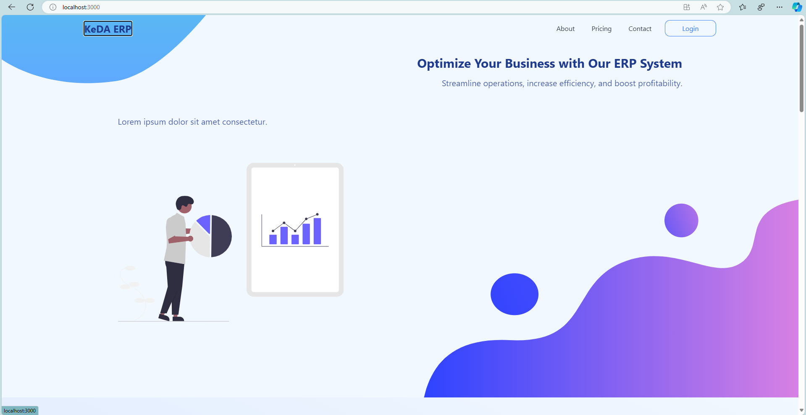
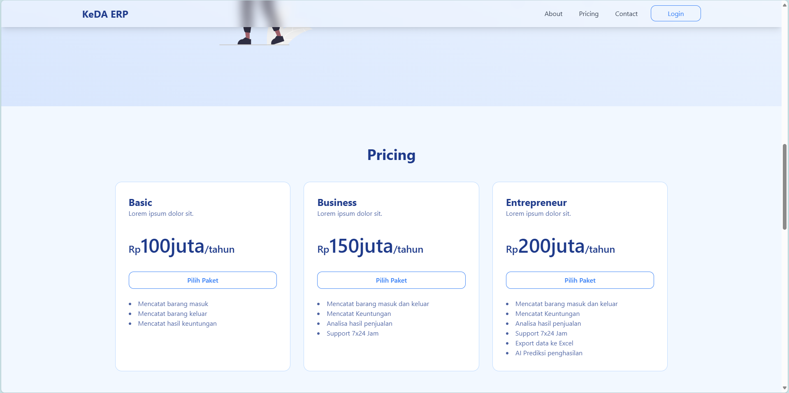
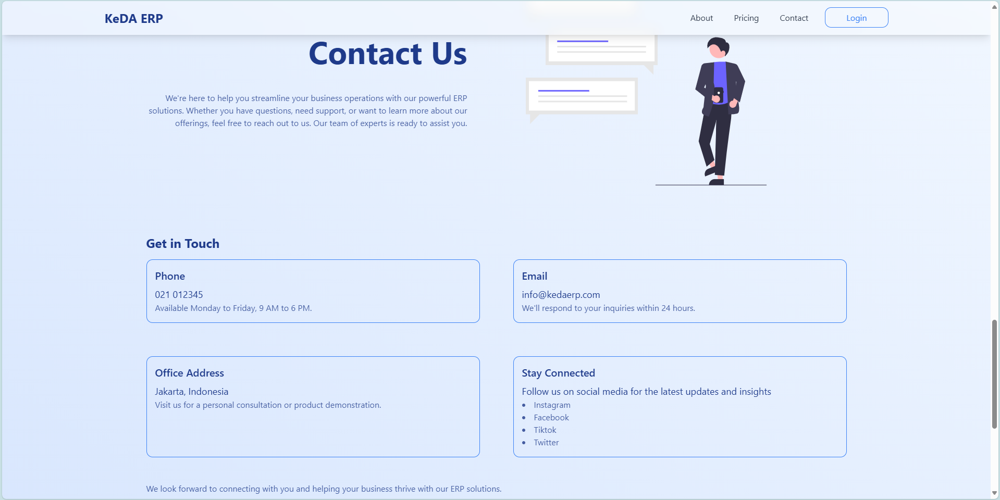
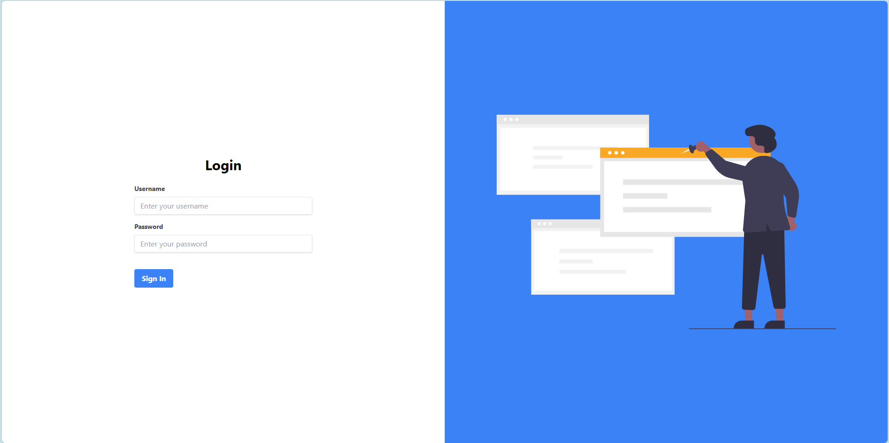

# KeDA Tech ERP Landing Page

## Overview

This landing page is designed to introduce the features and benefits of an ERP system, providing users with an interactive, responsive interface built with ReactJS, React Router DOM, and Tailwind CSS. The landing page will include sections such as a header, hero section, pricing, and contact forms, all connected with smooth routing using React Router DOM.

## Techstack

###### 1. React App

React is the library for web and native user interfaces. 
Build user interfaces out of individual pieces called components written in JavaScript. React is designed to let you seamlessly combine components written by independent people, teams, and organizations.

###### 2. React Router DOM

For navigation and routing between pages.
React Router is a lightweight, fully-featured routing library for the React JavaScript library. React Router runs everywhere that React runs; on the web, on the server (using node.js), and on React Native.

###### 3. Tailwind CSS

Utility-first CSS framework for styling.
Tailwind CSS works by scanning all of your HTML files, JavaScript components, and any other templates for class names, generating the corresponding styles and then writing them to a static CSS file.
It's fast, flexible, and reliable with zero-runtime.

## Project Structure

The folder structure for this project will look like this:

```bash
📂react-erp-kedatech/
│
├── 📁public/
├── 📂src/
│   ├── 📂components/
│   │   ├── 📂svg/
│   │   │   ├── ⚛️About.tsx
│   │   │   ├── ⚛️BottomClipPath.tsx
│   │   │   ├── ⚛️Hero.tsx
│   │   │   ├── ⚛️Login.tsx
│   │   │   ├── ⚛️Social.tsx
│   │   │   └── ⚛️TopClipPath.tsx
│   │   │
│   │   └── ⚛️PriceCard.tsx
│   │   
│   ├── 📂pages/
│   │   ├── ⚛️Home.tsx
│   │   └── ⚛️Login.tsx
│   │   
│   ├── 📄App.css
│   ├── ⚛️App.tsx
│   ├── 📄index.css
│   ├── ⚛️index.tsx
│   └── 🖼️logo.svg
│
├── 📄package.json
├── 📄pnpm-lock.yaml
├── 📄README.md
├── 📄tailwind.config.js
└── 📄tsconfig.json

```

## Installation

###### 1. Clone the repository and navigate to the project folder:

```bash
git clone https://github.com/anggarobo/kedatect-test.git
cd kedatect-test/react-erp-kedatech
```

###### 2. Install dependencies:

```bash
npm install
```

###### 3. Run the development server:

```bash
npm run start
```

## User Interface

<div>
    <figure>
        
        <figcaption>Hero</figcaption>
    </figure>
    <figure>
        
        <figcaption>Pricing</figcaption>
    </figure>
    <figure>
        
        <figcaption>Contact</figcaption>
    </figure>
    <figure>
        
        <figcaption>Login Page</figcaption>
    </figure>
</div>
