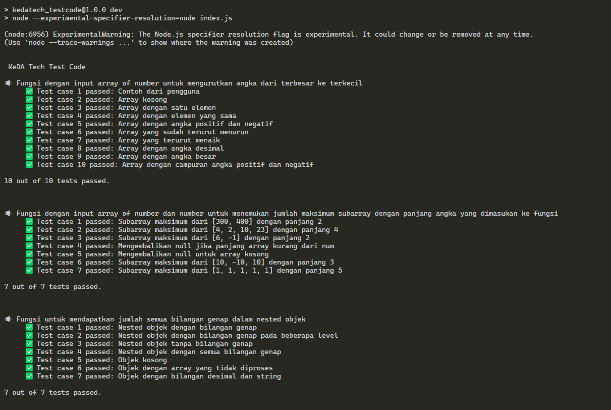

# Documentation

## Issues

1. Buatlah fungsi dengan input array of number untuk mengurutkan angka dari terbesar ke terkecil dengan manual tanpa fungsi bawaan javascript
    ```javascript
    Input : [1, 2, 4, 3, 5, 3, 2, 1]			
    Expected Output : [5, 4, 3, 3, 2, 2, 1, 1]
    ```
 
2. Buatlah fungsi dengan input array of number dan number untuk menemukan jumlah maksimum subarray dengan panjang angka yang dimasukan ke fungsi
    ```javascript
    Input : ([100, 200, 300, 400], 2)				
    Expected Output : 700 	// didapatkan dari 300 + 400
    ---
    Input : ([1, 4, 2, 10, 23, 3, 1, 0, 20], 4)		
    Expected Output : 39 	// didapatkan dari 4 + 2 + 10 + 23
    ---
    Input : ([-3, 4, 0, -2, 6, -1], 2)				
    Expected Output : 5 	// didapatkan dari 6 + -1
    ```
 
3. Buatlah fungsi untuk mendapatkan jumlah semua bilangan genap dalam nested objek
    ```javascript
    Input : {
            outer: 2,
            obj: {
                inner: 2,
                otherObj: {
                superInner: 2,
                notANumber: true,
                alsoNotANumber: "yup"
                }
            }
        },
    Output: 6,
    ---
    Input: {
        a: 2,
        b: {b: 2, bb: {b: 3, bb: {b: 2}}},
        c: {c: {c: 2}, cc: 'ball', ccc: 5},
        d: 1,
        e: {e: {e: 4}, ee: 'car'}
    },
    Output: 12
    ```

## Documentation for the three functions

#### 1. Functions: sort.descending

###### Description:

This function sorts an array of numbers in descending order manually, without using any built-in JavaScript sorting functions. It implements a bubble sort algorithm that compares and swaps elements to arrange the numbers from largest to smallest. 

###### Syntax:

```javascript
sort.descending(array)
```

###### Parameter:

- `array` (Array of numbers): The array of numbers to be sorted in descending order.

###### Return:

- (Array of numbers): A new array sorted from largest to smallest.
    
###### Example:

```javascript
const sortedArray = sort.descending([1, 2, 4, 3, 5, 3, 2, 1]);
// Expected Output: [5, 4, 3, 3, 2, 2, 1, 1]
```

###### Unit Test:

```javascript
function runSortTests() {
    const testCases = [
        {
            input: [1, 2, 4, 3, 5, 3, 2, 1],
            expected: [5, 4, 3, 3, 2, 2, 1, 1],
            description: 'Standard array sorting'
        },
        {
            input: [5, 3, 8, 6],
            expected: [8, 6, 5, 3],
            description: 'Array with distinct elements'
        },
        {
            input: [1, 1, 1],
            expected: [1, 1, 1],
            description: 'Array with identical elements'
        },
        {
            input: [],
            expected: [],
            description: 'Empty array'
        },
    ];

    testCases.forEach((test, index) => {
        const result = manualSortDesc(test.input);
        console.log(result);
        console.assert(
            JSON.stringify(result) === JSON.stringify(test.expected),
            `Test ${index + 1} failed: ${test.description}`
        );
    });
}

runSortTests();
```

#### 2. Function maxSubarraySum

###### Description:

This function finds the maximum sum of a subarray with a given length. It uses the sliding window technique to efficiently compute the maximum sum by adjusting the window size while traversing the array.

###### Syntax:

```javascript
maxSubarraySum(array, number)
```

###### Parameter:

- `array` (Array of numbers): The array of numbers to be sorted in descending order.
- `number` (Number): The length of the subarray to be evaluated for the maximum sum.

###### Return:

- (Number | `null`): The maximum sum of the subarray with the given length, or null if the array is smaller than the given subarray length.
    
###### Example:

```javascript
const maxSum = maxSubarraySum([100, 200, 300, 400], 2);
// Expected Output: 700
```

###### Unit Test:

```javascript
function runMaxSubarrayTests() {
    const testCases = [
        {
            input: { arr: [100, 200, 300, 400], num: 2 },
            expected: 700,
            description: 'Subarray of length 2, max sum from [300, 400]'
        },
        {
            input: { arr: [1, 4, 2, 10, 23, 3, 1, 0, 20], num: 4 },
            expected: 39,
            description: 'Subarray of length 4, max sum from [4, 2, 10, 23]'
        },
        {
            input: { arr: [-3, 4, 0, -2, 6, -1], num: 2 },
            expected: 5,
            description: 'Subarray of length 2, max sum from [6, -1]'
        },
        {
            input: { arr: [], num: 2 },
            expected: null,
            description: 'Empty array, should return null'
        },
    ];

    testCases.forEach((test, index) => {
        const result = maxSubarraySum(test.input.arr, test.input.num);
        console.assert(
            result === test.expected,
            `Test ${index + 1} failed: ${test.description}`
        );
    });
}

runMaxSubarrayTests();
```

#### 3. Function sumEvenNumbers

###### Description:

This function calculates the sum of all even numbers within a nested object. It recursively traverses the entire object, identifying numbers and adding the even ones to the sum.

###### Syntax:

```javascript
sumEvenNumbers(obj)
```

###### Parameter:

- `obj` (Object): A nested object containing numbers, objects, and other values. The function will sum up the even numbers within this structure.

###### Return:

- (Number): The sum of all even numbers found in the object.
    
###### Example:

```javascript
const totalEvenSum = sumEvenNumbers({
    outer: 2,
    obj: {
        inner: 2,
        otherObj: {
        superInner: 2,
        notANumber: true,
        alsoNotANumber: "yup"
        }
    }
});
// Expected Output: 6
```

###### Unit Test:

```javascript
function runSumEvenNumbersTests() {
    const testCases = [
        {
            input: {
                outer: 2,
                obj: {
                    inner: 2,
                    otherObj: {
                        superInner: 2,
                        notANumber: true,
                        alsoNotANumber: "yup"
                    }
                }
            },
            expected: 6,
            description: 'Sum of even numbers in nested object'
        },
        {
            input: {
                a: 2,
                b: { b: 2, bb: { b: 3, bb: { b: 2 } } },
                c: { c: { c: 2 }, cc: 'ball', ccc: 5 },
                d: 1,
                e: { e: { e: 4 }, ee: 'car' }
            },
            expected: 12,
            description: 'Sum of even numbers in a deep nested object'
        },
        {
            input: { a: 1, b: { c: 3, d: { e: 5 } } },
            expected: 0,
            description: 'No even numbers in the object'
        },
        {
            input: {},
            expected: 0,
            description: 'Empty object, should return 0'
        },
    ];

    testCases.forEach((test, index) => {
        const result = sumEvenNumbers(test.input);
        console.assert(
            result === test.expected,
            `Test ${index + 1} failed: ${test.description}`
        );
    });
}

runSumEvenNumbersTests();
```

## Summary of Functions:

###### 1. `manualSortDesc(arr)`:

Sorts an array of numbers from largest to smallest without using built-in sort functions.

###### 2. `maxSubarraySum(arr, num)`:

Finds the maximum sum of a subarray with a given length.

###### 3. `sumEvenNumbers(obj)`:

Sums up all even numbers found within a nested object.
Each function includes comprehensive unit tests to validate its functionality and edge cases.


## Installation

```bash
> git clone https://github.com/anggarobo/kedatect-test.git
> cd kedatech-test/test_code
> npm run dev
```


## User Interface

